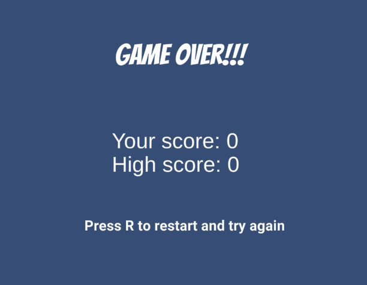

# 🐍 Snake: an exercise in game development

I was inspired by GMTK's video "How I learned Unity without following tutorials". His idea was to learn the very basics of Unity game engine (things like game objects, components, transforms, scene editor controls) and then create several simple game clones and learn the rest "on demand", when it's needed in the game. This resonated with me, so I decided to go with Snake which I liked a lot as a kid. I came up with a plan for 7 days to keep me focused and produce a finished game that I can publish it on itch.io and send it to friends or strangers to play.

<figure><figcaption>
My take on the classic
</figcaption></figure>

I've managed to stick to my plan, see [my published game on itch.io](https://dsphynx.itch.io/snake) and source code on [GitHub](https://github.com/sphynx/snake/). Some of those seven "days" were short (1-2 hours of work), some were longer (5-6 hours), but overall the planning was good, the process was fun, so I decided to share it along with some Unity/C# knowledge I've learnt (something for next posts).

I think it may be also useful for people who want a large but structured exercise in game development.

### Game Design Document

Before implementing a game clone, I think it's very important to understand in advance what you want to implement: which features/power-ups of the original game to support. This will limit your scope and make possible to actually finish the project. It is also useful to set some time limits for things like game sprites or sounds: one may spend ages tinkering with the visuals and never attain perfection! As someone in the Internet said: "Your first game will be ugly", so there is no need to focus on that too much.

Also, before coming up with a plan I went to itch.io and looked at existing Snake implementations to get ideas and remind myself of the gameplay, see how people display scores, endgame screens and other stuff.

I ended up with this "design document":

> Create a clone of a basic Snake game, with a snake, apples, and walls on a rectangular 2D grid. The player can press arrow keys to move the snake. Speed of the snake should gradually increase. The game should keep the score: number of eaten apples. It should also keep high-score (fine to keep it in memory).
>
> There should be different sprites for snake head and snake body, they should be properly oriented.
>
> There should be basic 2-frame animations on some sprites (snake head, apples).
>
> There should be background music, plus sounds for eating an apple and hitting the wall. It can be sourced from free game assets.
>
> There should be title game screen with some nice picture, the main "level" where gameplay is happening, and the end game screen displaying the score and high score when snake dies.

It's not a proper Game Design Document of course, just a list of points that must be implemented to consider the game done. To get a feel of real GDD, you can look at [this](https://www.cs.unc.edu/Courses/comp585-s15/DesignDocTemplate.pdf) template from a course in University of North Carolina.

### Plan

When working on the items from the list below, I kept a dev log, adding short notes about difficulties I had, resources used, things learnt, and rough amount of time I spent. It was useful and allows me to resurrect those experiences now.

#### Day 1

* [ ] Come up with a data structure to represent a rectangular grid.
* [ ] Come up with a data structure to represent the snake. In Unity, those two may be just plain C# classes or GameObjects.
* [ ] Think about and choose a coordinate system to use to refer to your grid positions.
* [ ] Display the grid and the snake (motionless for now) on the screen. Just use simple 2D square tiles: say white square for the snake, black square for empty space and gray square for the walls.

#### Day 2

* [ ] Implement the snake moving logic, i.e. what happens to your data structure after one step of the snake movement. You also need to save the current direction of movement somewhere.
* [ ] Make the snake move on the screen.
* [ ] Take input from the keyboard: just arrow keys for now. Make it affect the movement.
* [ ] Add game controller support for extra challenge (and if you have one).

#### Day 3

* [ ] Spawn apples.
* [ ] Add score and "apple eating" logic, i.e. what happens if snake's head hits an apple: it should increase the score and spawn a new apple.
* [ ] Detect hitting the wall or itself, which is a game over condition. For now we can just print a log message on game over.

#### Day 4

* [ ] Add basic UI: a line displaying current score.
* [ ] Add separate GameOver screen: another scene/level, that shows the final score and the high score.
* [ ] Add a hotkey to restart the game from GameOver screen (say, on pressing "R").
* [ ] Preserve high score between games.

#### Day 5

* [ ] Find sprites for snake head, body, apples and walls. Use assets from itch.io, OpenGameArt, or other sources listed here: [https://www.freegameassets.com/](https://www.freegameassets.com/)
* [ ] Fugure out how to deal with spritesheets
* [ ] Use the new sprites in the game
* [ ] Orient them properly so that the head looks in the right direction

#### Day 6

* [ ] Add simple 2-frame animation (for apples for example, so that they are more attracting, or maybe for hitting the obstacle)
* [ ] Create the start screen that should display the game title, authors and ask to press Enter to start the game
* [ ] Find a nice Snake-themed free picture for the start screen
* [ ] Find and use sounds when apple is eaten and wall is hit
* [ ] Find and use background music, probably a chiptune from OpenGameArt

#### Day 7

* [ ] Polish: adjust colors, sizes, game speed progression, etc.
* [ ] Fix remaining bugs
* [ ] Figure out how to build the game for itch.io (WebGL-based build, playable in the browser)
* [ ] Upload to itch.io, test and make sure it works in the browser

### Conclusion: now it's your turn!

As you may have noticed, there is almost nothing Unity-specific in this plan, so it can be easily applied to learning any other game engine. Admittedly Snake is a very simple game, so if you just want to make Snake (and not to learn Unity), then it may even make sense to code it in a simpler 2D engine.

So give it a go, try to follow the plan or adjust it to your taste and see where it takes you! Please feel free to send links to your published games to my email: "veselov" at google mail, I'll be happy to see them.

In the next posts I plan to cover how I fared with that plan, reflecting on my dev log and sharing insights, so you can come back later and compare our experiences.

### Bonus: materials for learning basics of Unity

If you are really new to Unity and want to learn those basics I mentioned in the very beginning, I found those resources helpful:

* Brackey's playlist "[How to make a game in Unity](https://www.youtube.com/playlist?list=PLPV2KyIb3jR53Jce9hP7G5xC4O9AgnOuL)" - 10 short videos (each about 10 minutes), fast paced, well explained and to the point. It covers the basics: game objects, components, transforms, C# scripting and using the Scene editor. And at the end you have quite a fun 3D (!) game!
* For people with some experience with programming, I found Unity documentation quite good: you can start from "[Game Object](https://docs.unity3d.com/Manual/GameObjects.html)" section in Unity Manual. Another good reference is "[Important classes](https://docs.unity3d.com/Manual/ScriptingImportantClasses.html)" page which explains the classes you will see used in Unity code all the time. There are also simpler official Unity tutorials, ava
* CatLikeCoding tutorials are text-based and usually quite in-depth. [This one](https://catlikecoding.com/unity/tutorials/basics/game-objects-and-scripts/) explains how game objects and scripts work in Unity, creating a 3D clock in Unity as an example.
