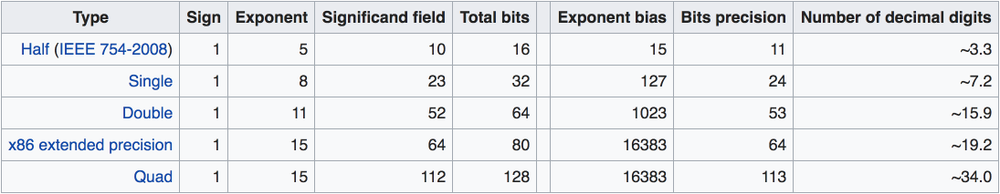

# printf\(\) and floating point numbers

### Problem setup

One day we had certain mismatch between floating point numbers. One number when inspected in an IDE looked much longer than the other, having lots of extra digits. Then a colleague of mine said that it's fine, they might still be the same number, and produced some code similar to this:

```c
#include <stdio.h>

int main(void)
{
    double d = 0.1234567890123456;  // 16 digits 
    printf("%.16f\n", d);
    printf("%.55f\n", d);
    return 0;
}
```

What do you think it will print? Most programmers know that double precision has about 16 significant decimal digits when numbers are in that range \(i.e between 0 and 1\). So I am printing here 16 digits first and then some more just to see what comes next. It prints this:

```bash
➜ gcc 1.c && ./a.out
0.1234567890123456
0.1234567890123455941031593852130754385143518447875976562
```

This looked like quite a lot of extra digits and it did not even stop there!

I know that we represent real decimal numbers with bits stored according to IEEE 754 floating point standard, so our decimal literal is somewhat imprecisely stored in binary representation. Now it looks like `printf` is printing that decimal representation. However, what was surprising to me is that this imprecise representation can be expanded to so many new decimal digits.

**TLDR:** `printf` prints decimal expansion of the binary number corresponding to our original literal. Binary number approximates the literal. There can be maximum `53 - binary exponent` digits in the decimal expansion \(at least for "normal" numbers\). Read below for the details.

### Plan of attack

Let's figure out step by step what's happening in this little program. The interesting steps with accompanying questions I had are below:

1. Compiler has to convert that string representing a decimal C-literal into a double. How that should be done? Are there any restrictions on the literal length?
2. That double is represented with some bits. What bits exactly? How they are laid out in memory? Can I build them by hand?
3. Those bits can be converted back to decimal and printed with `printf`. How many digits can I expect in this decimal expansion?

Let's first address the representation question, then we'll have terminology to discuss parsing of the literals and finally converting back to decimal with `printf`.

### Representing doubles with IEEE 754

I assume that you more or less know what a floating number is. As a quick reminder, it's a number which is represented as follows: `sign * significand * (base ^ exponent)`

* _Sign_ here can be either -1 or 1. 
* _Significand_ \(also called _mantissa_\) always starts with '**1.**' \(note the dot at the end!\). Since it always starts with 1, there is no need to store that 1 in actual bit representation when we get to it.
* _Base_ is 2 in our case. 
* _Exponent_ is a scaling factor, it is the number of positions we have to move the dot "." to the right or to the left to get back to our number.

For example binary 101.1 can be represented as `1 * 1.011 * (base ^ 2)`, sign is 1, significand is 1.011 and we need to scale it two positions to the right, so exponent is `+2`. 

In order to convert a real decimal number into bits of `double` we can do the following steps.

#### 1. Get exact binary representation of the decimal number we are trying to convert. 

It will most likely contain the repeating fractional part unless it can be represented as `P / Q` where `Q` is an exact power of 2 and `P` is an integer. 

In our case `0.1234567890123456` corresponds to binary: `0.0001111110011010110111010011011101000110111101100101100101101100110...`

We haven't even get to the repeating part, but that's alright since we only need the beginning.

#### 2. Take 53 bits starting from the first digit 1 \(and including it\). 

This is because IEEE 754 double has 53 bits of precision. You can look up those numbers in corresponding Wikipedia table.



So we take this 53-bits long part in the middle:

`0.000 11111100110101101110100110111010001101111011001011001 011011...`

If the next bit after those 53 is `1` we should also add `1` to that large part. In our case it's `0` so we are fine.

#### 3. Figure out what the exponent should be. 

Our first `1` is 4 positions to the right from the dot. So in our case the exponent will be `-4`. However, in IEEE 754 exponents are stored with a particular bias which has to be added before we store it in bits. For double precision this bias is 1023, so we have to add that to `-4` getting `1019` which we need to store as unsigned integer in 11 bits of exponent \(those numbers can also be taken from the table above\).

#### 4. Combine the parts

The memory layout for doubles is as follows \(assumes Big Endian order\):


Our number is positive, so we use `0` for sign. Exponent is `1019` which is `01111111011` if represented with 11 bits. And we've got our 53 precision bits of the significand which we need to pack into 52 bits. This is easily done, since the first bit is always 1, so we never store it. In the end we get this:

`0 01111111011 1111100110101101110100110111010001101111011001011001`

which should be 64 bits representing our double `0.1234567890123456` in memory! Whoa, that was a lot of work. Let's check if we did it right with some Rust code \(it's easier to print bits in Rust than in C\):

```rust
fn main() {
    let d: f64 = 0.1234567890123456;
    d.to_be_bytes().iter().for_each(|b| print!("{:08b}", b));
    println!();
}
```

When we run this we get exactly the bits we calculated before, success!

```bash
➜ rustc a.rs && ./a
0011111110111111100110101101110100110111010001101111011001011001
```

### Literals conversion

Now we have the terminology to tackle the next question: how C literals from the program are parsed into doubles? Are there any limitations on length? 

Apparently, according to this StackOverflow [answer](https://stackoverflow.com/a/649108/211906) and [C99 standard](http://c0x.coding-guidelines.com/6.4.4.2.html), there are no limitations on length of double literals \(at least I don't see it in the grammar and I can use literals with thousands digits and it compiles just fine\). The double representation we'll get should be the closest representable number or one before or after it, depending on the implementation. So yes, you can use literals like 0.123456789012345678901234567890 with 30 digits, but most of those digits would be wasted since it's too precise to be represented in double precision format. 

To quote from C99 standard:

> The significand part is interpreted as a \(decimal or hexadecimal\) rational number; the digit sequence in the exponent part is interpreted as a decimal integer. For decimal floating constants, the exponent indicates the power of 10 by which the significand part is to be scaled. \[...\] For decimal floating constants, and also for hexadecimal floating constants when `FLT_RADIX` is not a power of 2, **the result is either the nearest representable value, or the larger or smaller representable value immediately adjacent to the nearest representable value, chosen in an implementation-defined manner**.

### Conversion back to decimal with printf

Now let's see what's happening with that `printf`. It takes all those bits we used for binary representation, converts it back to exact decimal and prints it with specified precision. How long we can expect the decimal representation to be, i.e. how many digits does it have before starting the string of zeroes at the end?

Originally I thought that since we have 53 binary digits in significand \(mantissa\) for numbers close in scale to 1 \(with exponent = 0\), the smallest number we can represent is about $$ 2^{-53} \approx 10^{-16}$$ And I thought that it should mean that we should have approximately 16 digits or slightly more in the decimal representation of those bits and if we ask for more we should get zeros. But that is not true. To get an idea why, we can just look at $$ 2^{-3} $$ which is 0.125. It has 3 digits after do in its decimal expansion, even though it's very close to $$ 10^{-1} $$ and by reasoning above should have about 1 or "slightly more" digits. 

Let's look at the table of decimal expansions for $$ 1 / 2^i $$ values for consecutive `i`s. This corresponds to the value of `i`-th bit in the significand.

| Bit number | Fraction | Decimal expansion |
| :--- | :--- | :--- |
| Bit 1 | 1 / 2 | 0.5 |
| Bit 2 | 1 / 4 | 0.25 |
| Bit 3 | 1 / 8 | 0.125 |
| Bit 4 | 1 / 16 | 0.0625 |
| Bit 5 | 1 / 32 | 0.03125 |
| Bit 6 | 1 / 64 | 0.015625 |

It looks like every new bit adds a new digit to the decimal! So, if we have 53 bits in the significand, we can have up to 53 digits in the decimal expansion! \(For now we disregard exponent, which can be just zero for those examples\).

This makes sense: if we want to represent $$1/2^n$$ in decimal, we will represent it as a sum of decimal digits, each of them is $$1/10^i$$ for some $$i$$. Note that $$1/10^i = 1/(2^i \times 5^i)$$And if we want to represent original $$1/2^n$$ in decimal, we will need to have one of those digits, i.e. some $$i$$ at least as big as $$n$$ \(otherwise we won't have enough precision, not enough 2-s in the denominator\). And this means that we need to have at least $$n$$ decimal digits in the expansion to represent $$1/2^n$$, which the table above demonstrates.

So now we can see that it's completely fine to have so many digits from `printf` and we also have an upper bound on them. For example in our case we should expect no more than 53 + 4 digits after the dot. "+4" because we use `-4` exponent, which can add more digits. Indeed, if we add some more precision to our original program, we can see that decimal representation of our double has 56 digits \(and zeros after that\):

```bash
➜ printf "%.60f\n" 0.1234567890123456
0.123456789012345594103159385213075438514351844787597656250000
```


