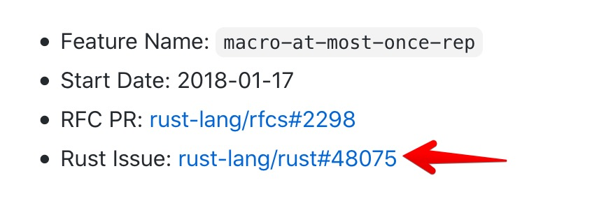
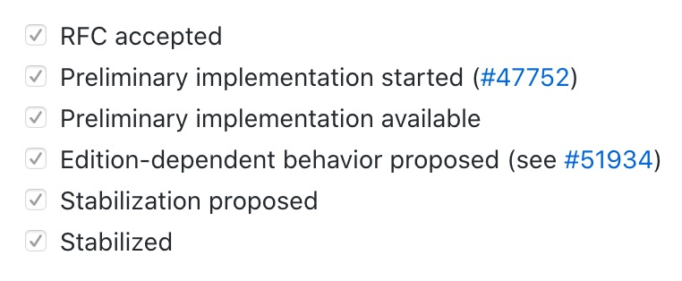
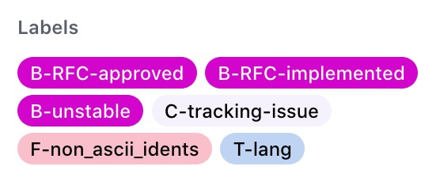
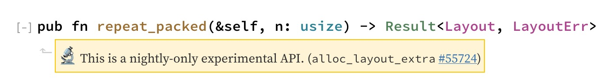

# Checking status of Rust features

## Problem: How to find a feature status?

Sometimes I want to quickly tell whether a particular feature in Rust is supported and if so, to what extent? Is it: 

* in nightly \(for how long then?\)
* stabilised \(since when?\)
* just being discussed?

The goal of this post is to provide a simple algorithm for finding relevant feature details, learning its status and for how long the feature was in that status. If it's stuck in nightly for years, then it's not very likely that it will be stabilised soon.

Along the way, I'll also describe lifecycle of a typical feature and the RFC process.


**TL;DR** The algorithm is to just follow the feature lifecycle, noting the feature gate, relevant Github labels and dates when state changes. Then double check in [The Unstable Book](https://doc.rust-lang.org/unstable-book/the-unstable-book.html) and potentially in rustc source code in [`src/librustc_feature`](https://github.com/rust-lang/rust/tree/master/src/librustc_feature) ****


## Lifecycle of a typical feature

Understanding features lifecycle is important when making sense of different feature states.

1. Someone has a new idea for Rust feature 💡 
2. If it's _substantial,_ they need to prepare an RFC. If not, they just create a Github issue for the feature.


**Q**: What is RFC? 

**A**: It stands for "Request for Comments". It's a well structured document summarising a feature, motivation behind it, its usefulness, potential drawbacks and alternatives. Its goal is to advertise the feature and to persuade other people to include it in the language. [Example.](https://github.com/rust-lang/rfcs/blob/master/text/2298-macro-at-most-once-rep.md)


3. When the RFC is ready, they send a pull request to [RFC repo](https://github.com/rust-lang/rfcs). 

4. People discuss the RFC and eventually propose to start so called _FCP_ - Final Comment Period, along with current disposition \(merge, close, postpone\). It lasts 10 days.

5. FCP ends and RFC pull request is either merged, closed or gets back to the previous state \(if some new ideas or issues are discovered during FCP\). You can find all merged RFCs starting from 0001 in [The RFC Book](https://rust-lang.github.io/rfcs/).


Potential confusion: if you see RFC pull request in status "Merged" on GitHub -- this means only that: RFC is merged. This **doesn't** mean that the feature _itself_ is implemented.


6. When RFC is merged, it gets its "_tracking issue_", the link to that is added to RFC header:



Tracking issue is used to track the progress of implementation, questions which need to be resolved, etc. Further discussions normally happen here. The issue has a plan with checkboxes:



7. Eventually the feature is implemented and merged into `master`. It becomes part of the next `nightly` release. Since it's not yet stable we don't want people to accidentally use it \(since it can still be seriously changed and then their code may break\). So, one has to explicitly add a _feature gate_ to the source file, like this: `#![feature(box_syntax)]`. Normally, identifier for feature gate is the same as feature name in RFC.

All unstable nightly feature gates are available in [The Unstable Book.](https://doc.rust-lang.org/unstable-book/the-unstable-book.html) Remember that: we'ill use it later.

8. While features are used in `nightly` people collect feedback, resolve questions, check more chekboxes in the plan and if everything goes well, prepare features for stabilization. That involves creating one more document and one more Final Comment Period, oh well. Eventually, everyone is happy and the feature is considered stable.

## Useful labels in Rust repo

How do we know the current state of a particule issue? One of the easy way is to check its Github labels that look like this:



Useful labels for our cause are under "B-":

* B-RFC-approved - Approved by a merged RFC but not yet implemented
* B-RFC-implemented - Approved by a merged RFC and implemented
* B-unstable - Implemented in nightly compiler and unstable

## The Algorithm

Still with me? Now I am going to present the Algorithm. Its idea is to just follow the feature lifecycle, keeping track of dates when states change. This way we can understand what the current state is and how much time was spent in different stages.

To help us we will use Labels, issue checkboxes and The Unstable Book.

### Steps

Starting point: you want to know about some feature, for example "Unicode characters in variable names".

1. Just google that and identify relevant RFC on Github, if there is one
2. Check status of its pull request, note feature name and tracking issue
3. Go to tracking issue, see what labels are there, look for "B-RFC-approved", "B-RFC-implemented", "B-unstable"
4. Look at checkboxes in the tracking issus, particularly for "implementation" and "stabilization" steps.
5. Double check in The Unstable Book looking for feature gate from \(2\). If it's there: you have unstable feature available on nightly. If it's not there, it's either stabilised or not implemented \(you can usually tell from step 4\).

That's it. We will take a look at examples in the next section.

There is another starting point: you just see unstable feature in the documentation, like this:



Then you immediately have a link to tracking issue, know the feature gate and know that it's unstable, so you basically don't need to do anything else :\)

## Examples of applying the Algorithm

### Unicode identifiers

Let's say we want to know if we can use Greek characters for naming variables like αβ.

1. Googling "unicode characters in rust variables" gives me this RFC: [https://rust-lang.github.io/rfcs/2457-non-ascii-idents.html](https://rust-lang.github.io/rfcs/2457-non-ascii-idents.html)
2. If it's in RFC book, this means that its RFC is merged, that's encouraging. I note the feature name: `non_ascii_idents` and go to the tracking issue: [https://github.com/rust-lang/rust/issues/55467](https://github.com/rust-lang/rust/issues/55467)
3. I can see the label "B-unstable" which means that it's implemented and is at least unstable \(but it may have stabilized later\)
4. I then cross check by looking up `non_ascii_idents` in The Unstable Book: [https://doc.rust-lang.org/unstable-book/language-features/non-ascii-idents.html](https://doc.rust-lang.org/unstable-book/language-features/non-ascii-idents.html) - it's there, great.

**Conclusion**: feature status is "implemented, unstable", i.e. in nightly

### Minimum supported Rust version

This feature is about being able to specify minimum version of Rust in `Cargo.toml` using something like `rust = "1.35"`.

1. Start from RFC PR: [https://github.com/rust-lang/rfcs/pull/2495](https://github.com/rust-lang/rfcs/pull/2495) -- which I googled and found through Reddit
2. We can see that it's merged, so RFC is approved. Note feature\_name from rendered RFC: `min_rust_version`
3. Now I would normally check Rust Unstable book looking for that feature gate. But in the case there is no point, since this feature is for Cargo.toml, not for Rust code
4. Now we follow tracking issue: [https://github.com/rust-lang/rust/issues/65262](https://github.com/rust-lang/rust/issues/65262)
5. We can see here that it's open and that "Implement the RFC" is not checked, so no luck, it's not even implemented yet. We can also see that it was created on Oct 2019, about 10 months ago.

**Conclusion**: RFC accepted, feature not implemented yet

### Others 

I won't bore you with repeating the steps for other cases, just give you links to issues, so that you can see how they look:

* [Stabilized feature](https://github.com/rust-lang/rust/issues/48075)

## ⚠Potential problems 

It all looked nice and easy, I was inspired and even wanted to automatically prepare some statistics about Rust unstable features. But when I started looking at features case by case, I found irregularities. Trying to make sense of those irregularities actually led me to writing this post. Let's look at potential problems and solutions.

#### It a feature has "B-unstable" label, it might already be stable, the tag is just never removed

Look in "Unstable book" and for "Stabilization" checkbox in the tracking issue to understand whether its stabilized.

#### If RFC PR is Closed \(not Merged\), this still can mean that it was actually approved for implementation

Not sure how it works, but I've seen this a couple of times.

#### Some features have several tracking issues \(because there are too many comments\)

Usually they are cross-referenced, so it's fine, we can just go to the latest one.

#### Some issues do not have RFCs

If it's not that large and debatable, there is just a tracking issue for a particular feature gate, without any RFC.

#### Some feature have so many comments they start whole new "working groups" with separate repositories

For example, if you look for "allocators for containers" you'll get to the relevant RFC and tracking issue, but that leads to "Rust Allocators Working Group" [repo](https://github.com/rust-lang/wg-allocators) which has its own set of issues.

**"Stabilization checklist" may be still not checked in the tracking issue, even though it's stabilized**

For example [here](https://github.com/rust-lang/rust/issues/27389)

## Bonus: feature gates in \`rustc\` source code

Features gates have to be enforced by the compiler, so the list of features has to be somewhere in the code. For language features it's here: [src/librustc\_feature](https://github.com/rust-lang/rust/tree/master/src/librustc_feature)

There are three modules:

* active.rs - for unstable features
* accepted.rs - for stabilised features
* removed.rs - for, well, removed features \(which were once active\)

Looking at [accepted.rs](https://github.com/rust-lang/rust/blob/master/src/librustc_feature/accepted.rs) quickly shows when features were stabilized:

```rust
/// Allows the use of `if` and `match` in constants.
(accepted, const_if_match, "1.45.0", Some(49146), None),
/// Allows the use of `loop` and `while` in constants.
(accepted, const_loop, "1.45.0", Some(52000), None),
/// Allows `#[track_caller]` to be used which provides
/// accurate caller location reporting during panic (RFC 2091).
(accepted, track_caller, "1.46.0", Some(47809), None),
```

Note, that this covers only _language features_ affecting Rust compiler. _Library features_ are normally just introduced like this:

```rust
#[unstable(feature = "slice_ptr_range", issue = "65807")]
pub fn as_ptr_range(&self) -> Range<*const T> {
```

Here we have a stability annotation that has a feature gate and refers to a tracking issue. When the feature is stabilised that annotation is changed to `#[stable(feature = "slice_ptr_range", since = "1.0.79")]`

## Useful links 🖇 

* All details of the RFC process and features lifecycle are well described in Rustc Developer Guide: ["Implementing new features"](https://rustc-dev-guide.rust-lang.org/implementing_new_features.html), ["Stability attributes"](https://rustc-dev-guide.rust-lang.org/stability.html), ["Stabilizing features" ](https://rustc-dev-guide.rust-lang.org/stabilization_guide.html)
* ["This Week in Rust"](https://this-week-in-rust.org/) publishes not only links to new exciting Rust blog posts, but also new RFCs, approved RFC, new tracking issues and RFCs entering Final Comment Period on that particular week.

## Outro

I hope you've liked this post and can now navigate the labyrinths of RFCs and tracking issues more confidently.

I am interested in ways of improving the clarity of this whole process. If you want to comment you can either discuss this post on Reddit, [create an issue](https://github.com/sphynx/notes/issues/new/choose) on Github or drop me an email. Also please send pull requests to this [repository](https://github.com/sphynx/notes) if you want to fix/improve something. Thank you!


