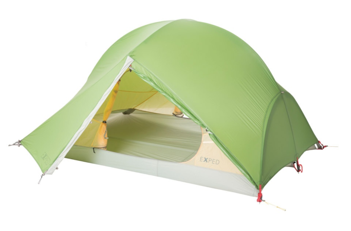
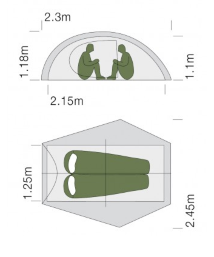

# Tents

In December 2019 I decided that it's time to replace my old and battered tent Trimm HimLite DSL \(its details [below](tents.md#trimm-himlite-dsl)\). We used it in many places for more than 5 years:

* Iceland \(twice\) - strong winds, rain
* Lake District \(UK\)
* Isle of Skye \(Scotland\) - strong winds, rain
* Burning Man festival \(Nevada, US\) - daily sandstorms, desert conditions
* Yellowstone National Park \(US\)
* King's Canyon National Park \(US\)
* Carpathian mountains - Gorgany \(Ukraine\)

It worked well most of the time and I still like it, it is a reliable tent, but since it was battered by winds and had a developed a small hole in the floor it was time to look at something new.

My main criteria were:

* a three season tent, suitable for relatively difficult weather conditions \(think Iceland, Scotland, Patagonia in summer\)
* within reasonable limits in terms of weight \(I've got spoiled by under 2kg tents\)
* enough space for two skinny people of average height

So I've created this note to help me with the choice and consolidate reviews/technical data about potential candidates here, in one place.

I think the choice was mostly influenced by many reviews I've read and personal experience of using my previous tents.

Spoiler: after all the research and several days of hesitation I bought Hilleberg Anjan 2 \(I managed to get the price down to 598 £ which is still quite a lot!\), hopefully I'll test it soon!

## Overview table

| Name | Weight, g | Floor, m² | Vestibule, m² | Materials \(floor/outer/inner\), D | Price, £ |
| :--- | :--- | :--- | :--- | :--- | :--- |
| MSR Hubba Hubba NX | 1720 | 2.7 | 1.62 = 0.81 x 2 | 30/20/20+15\(mesh\) | 385 |
| Nemo Dragonfly 2P | 1410 | 2.7 | 1.8 = 0.9 x 2 | 20/15/10 | 420 |
| Trimm HimLite DSL | 1600 | 2.5 | 0.65 | 10k H₂O / 4k H₂O | 370 € |
| Exped Mira II HL | 1500 | 2.7 | 1.3 | 20/20/15 | 380 |
| Hilleberg Niak | 1700 | 2.6 | 0.75 | 50\(12k H₂O\)/20/10 | 790 |
| ✅ Hilleberg Anjan 2 | 1800 | 2.6 | 1.2 | 50/20/10 | 715 |
| Hilleberg Anjan 2 GT | 2100 | 2.6 | 2.5 | 50/20/10 | 827 |
| Hilleberg Rogen | 2100 | 2.8 | 2.0 = 1.0 x 2 | 50/20/20 | 835 |

## MSR Hubba Hubba NX

[Official manufacturer link](https://www.msrgear.com/ie/products/tents/hubba-hubba-nx-2-person-backpackingandnbsp%3Btent/06204.html?srd=true)

I've kept this tent in the back of my mind all the time since reading a very favourable review on "ProPohody" site \(see below\). Then came the next review on the same website, which was less favourable: it covered the changes made to this tent in a new version of this model. This tent is very popular, you can often see it outdoors, in campsites or in random hiking videos on YouTube, I think this tells something about it. Also, it's nice that it doesn't come with additional cost when sold in the UK as opposed to other American tents: for example Nemo tents can cost about 150 GBP more than in the US!

In terms of materials it looks like this tent is in the middle between really lightweight tents from Nemo and more "heavy duty" tents from Hilleberg.

### Reviews

* [ProPohody](https://propohody.com/msr-hubba-hubba-nx-review/) \(in Russian\)
* [ProPohody \#2](https://propohody.com/msr-hubba-hubba-nx-2016/) \(in Russian\)
* [OutdoorGearLab](https://www.outdoorgearlab.com/reviews/camping-and-hiking/backpacking-tent/msr-hubba-hubba-nx) \(in English\)

### Buy

[385 GBP](https://www.ultralightoutdoorgear.co.uk/equipment-c3/tents-shelters-c25/two-person-tents-c26/hubba-hubba-nx-tent-p2405)

### Data

* floor area: 2.7 m² \(29 sq ft\)
* vestibule area: 1.62 m² \(17 sq ft\)
* weight: 1720 g
* rain fly: 20D nylon ripstop, PU coating \(1200mm\)
* inner tent: 20D nylon ripstop, 15D nylon mesh
* floor: 30D ripstop nylon, PU coating \(3000mm\), DWR coating

## Nemo Dragonfly 2p

[Official manufacturer link](https://www.nemoequipment.com/product/dragonfly/)

This tent got seriously raving reviews both from ProPohody and OutdoorGearLab. It is super lightweight \(1410 g!\) which still being spacious and convenient. However, I was put off by a delicate rain fly \(outer tent\), it is just 15D = 15 denier \(it's a measure of fabric density\) and by a weird cut in a rainfly on the side of the tent \(a screenshot from the [video review below](https://propohody.com/nemo-dragonfly-2p-review/)\):

This cut is suspiciously never visible on pictures from Nemo official website. According to the reviewers it's completely fine, since the bathtub floor is high and completely waterproof, but still, I don't like the look of it and don't see much point of it except for saving the weight, but for that price?

However, the comfort, total area and attention to details of this tent almost persuaded me to buy it, but then I realised that it might not be the best for Iceland/Scotland and other not so weather-friendly places I tend to visit.

### Reviews

* [ProPohody](https://propohody.com/nemo-dragonfly-2p-review/) \(in Ukrainian, video review\)
* [OutdoorGearLab](https://www.outdoorgearlab.com/reviews/camping-and-hiking/backpacking-tent/nemo-dragonfly-2) \(in English\)

### Buy

[420 GBP](https://www.ultralightoutdoorgear.co.uk/equipment-c3/tents-shelters-c25/two-person-tents-c26/dragonfly-2p-tent-p11473)

### Data

* floor area: 2.7 m² \(29 sq ft\)
* vestibule area: 1.8 m² \(20 sq ft\) = \(0.9 m² x 2\)
* weight: 1410 g
* rain fly: 15D nylon ripstop
* inner tent: 10D nylon ripstop
* floor: 20D nylon
* poles: 8.7mm

## Trimm HimLite DSL

[Official manufacturer link](https://www.trimm.cz/en/catalog/himlite-dsl-c1247.htm)

This is my current tent: I bought it around 6 years ago and described its usage in the introduction to this note. I decided to buy it after reading the review on ProPohody web site \(it's a great website by the way, if you happen to read Russian or Ukrainian\) and it hasn't disappointed! The ventilation is great, it's stable and tolerated quite serious winds in the Isle of Skye \(one pole has been slightly bent though\), the size - not so great: it feels somewhat cramped, especially with the backpacks inside, the vestibule is also on the smallish side.

### Reviews

* [ProPohody](https://propohody.com/trimm-himlite-dsl-review/) \(in Russian\)

### Data

* floor area: 2.5 m²
* vestibule area: 0.65 m²
* weight: ~1600 g \(my version\).
* floor: 10,000 mm H₂O
* rain fly: 4000 mm H₂O, nylon PU
* poles: 8.5mm
* height: 95 cm

## Exped Mira II HL

[Official manufacturer link](http://www.exped.com/italy/en/product-category/tents/mira-ii-hl)

This Swiss tent is a relatively late addition to the list, it looks like it's in the same class as [Nemo Dragonfly](tents.md#nemo-dragonfly-2p) but without the "weird cut": attention to details, lightweight, roomy and somewhat delicate. I'm using a simple waterproof urban backpack from Exped and I quite like it, so I'm already feeling somewhat loyal to the brand. However, when I added it to the list, I was already looking forward towards something more windproof, i.e. no fully mesh inner tent.

### Reviews

* [ProPohody](https://propohody.com/exped-mira-ii-hl-review/) \(in Russian\)

### Buy

[380 GBP](https://www.ultralightoutdoorgear.co.uk/equipment-c3/tents-shelters-c25/two-person-tents-c26/mira-ii-hl-tent-p3894)

### Data

* floor area: 2.7 m²
* vestibule area: 1.3 m²
* weight: 1500 g
* floor: 20D ripstop nylon, 1500 mm H₂O
* rain fly: 20D ripstop nylon
* inner tent: 15D nylon / 15D mesh
* poles: 8.5/9 mm
* height: 118 cm

## Hilleberg Niak

[Official manufacturer link](https://hilleberg.com/eng/tent/yellow-label-tents/niak/)

### Notes

Niak and other Hilleberg tents are apparently better equipped for bad weather: strong wind and long rain and since we are usually traveling to more challenging destinations \(like Iceland, Scotland, Patagonia, Lake District, etc.\), it might have more sense to invest in something more robust.

In particular, Hilleberg tents are set up "outer tent first", i.e. inner tent is already connected to an outer tent and you start pitching by just putting poles into sleeves of an outer tent, which make much more sense in rainy weather. Other tents in this list \(including our current one\) are "inner tent goes first", hence one either has to pitch the tent super quickly in the rain to minimise amount of rain getting into the tent or just wait until the rain stops or becomes less intense. The same goes about packing the tent: in Hilleberg you can even go inside, completely remove the inner tent under protection of the outer tent, pack it in the bag and only then start to dismantle the outer tent.

Niak was the first Hilleberg tent I started looking at, since it's the lightest. It comes from their "Yellow label" series, which are positioned as lightweight 3-season tents. But what is lightweight for Hilleberg, is not necessarily that for other produces in this list :\) I think the extra weight mainly comes from the thicker floor \(50D and 12000 mm H2O waterproof\) and more reliable furniture \(for example metal/alloy strap fasteners\).

Details about the fabric used in Hilleberg tents: [https://hilleberg.com/eng/about-our-tents/materials-uncompromising-quality/\#kerlon1000r](https://hilleberg.com/eng/about-our-tents/materials-uncompromising-quality/#kerlon1000r)

However, I was not very impressed by the area and width of this tent \(just 120 cm\). A single vestibule was also rather small. In the past it was even named Niak 1.5 to stress that it's not super comfortable for two people. So, after all I decided to pass on that and look at [Hilleberg Anjan](tents.md#hilleberg-anjan-2) which is more spacious.

### Reviews

[SwitchbackTravel](https://www.switchbacktravel.com/reviews/hilleberg-niak) \(in English\)

### Buy

In some shops it comes with a free footprint \(but you have to order it separately, it will be discounted from the price\).

* [790 GBP](https://www.ultralightoutdoorgear.co.uk/equipment-c3/tents-shelters-c25/all-tents-c148/niak-2-person-tent-p10986)
* [790 GBP - Taunton](https://www.tauntonleisure.com/hilleberg-niak-tent-green.html) - has free DPD delivery \(next working day\) and free footprint.

### Data

* floor area: 2.6 m²
* vestibule area: 0.75 m²
* weight: 1700 g
* outer tent: 20D ripstop nylon, 5000 H₂O, [Kerlon 1000](https://hilleberg.com/eng/about-our-tents/materials-uncompromising-quality/#kerlon1000r)
* inner tent: 10D ripstop nylon, DWR
* floor: 50D, 12 000 mm H₂O
* poles: 9mm

## Hilleberg Anjan 2

[Official manufacturer link](https://hilleberg.com/eng/tent/yellow-label-tents/anjan-2/)

As you can see this tent has tunnel shape, I never used them before, so initially I was freaked out. However, after watching [pitching instructions video](https://www.youtube.com/watch?v=0HEP5jzXRBA) from Hilleberg and reading some articles "dome vs tunnel tents" I was fine. Even though dome-shaped tents are more popular now, there is nothing wrong with tunnel shaped tents, they both have pros and cons. Those pros and cons suspiciously vary from article to article though :\)

I've decided to buy this tent because of the following considerations:

* almost all reviewers claimed that it was extremely weatherproof \(if you compare to other lightweight tents of course, not in absolute values\), OutdoorGearLab [gave it 10/10](https://www.outdoorgearlab.com/reviews/camping-and-hiking/backpacking-tent/hilleberg-anjan-2-gt#weather-resistance) for weather resistance
* it is still well under two kilos \(1800 g\), lighter than a typical Hilleberg tent
* it is pitched in "outer tent first" manner which looks very useful and reasonable in bad weather
* furniture looks amazing and reliable, allowing lots of adjustments
* Hilleberg seems to be a serious brand in the tents world and I'm a sucker for respectable brands :\)

It seems that there are several models of this tent, corresponding to different years. Amazingly \(and as opposed to the story with MSR Hubba Hubba NX\) Hilleberg has improved certain design shortcomings which were highlighted by older reviews: for example in my relatively new version of the tent they've seriously improved vestibule zipper protection against rain and replaced the pegs with better ones \(those two aspects were common weak points from older reviews\).

I am going to test the tent in Patagonia soon, hopefully I'll update this note with my own positive experience.

### Buy

* [650 GBP](https://www.ellis-brigham.com/hilleberg-anjan-2-tent-256218) - I was able to find it cheaper on Ellis Brigham in their Covent Garden shop in London! Moreover, I've got 10% discount because of my BMC membership, it was a great deal!
* [715 GBP](https://www.ultralightoutdoorgear.co.uk/equipment-c3/tents-shelters-c25/all-tents-c148/anjan-2-tent-p10499) - that's the standard price for it in the UK :\(
* Overall Hilleberg has [many dealers](https://hilleberg.com/eng/contact-support/dealers/) in the UK, but no one could sell me a red tent, the only available colour was dark green!

### Data

* floor area: 2.6 m² \(28 sq ft\)
* vestibule area: 1.2 m²
* weight: 1800 g
* outer tent: 20D ripstop nylon, 5000 H₂O, [Kerlon 1000](https://hilleberg.com/eng/about-our-tents/materials-uncompromising-quality/#kerlon1000r)
* inner tent: 10D ripstop nylon, DWR
* floor: 50D, PU, 12 000 mm H₂O

## Hilleberg Anjan 2 GT

[Official manufacturer link](https://hilleberg.com/eng/tent/yellow-label-tents/anjan-2-gt/)

This is just a version of [Anjan 2](tents.md#hilleberg-anjan-2) with an extended vestibule. I decided that there we don't need that much space for 300 extra grams and £112. Also, the extra length of the vestibule requires more space to pitch the tent, thus limiting the number of suitable areas for pitching.

### Buy

[827 GBP](https://www.alpinetrek.co.uk/hilleberg-anjan-2-gt-2-man-tent/)

### Reviews

[OutdoorGearLab](https://www.outdoorgearlab.com/reviews/camping-and-hiking/backpacking-tent/hilleberg-anjan-2-gt) \(in English\)

### Data

* floor area: 2.6 m² \(28 sq ft\)
* vestibule area: 2.5 m²
* weight: 2100 g
* outer tent: 20D ripstop nylon, 5000 H₂O, [Kerlon 1000](https://hilleberg.com/eng/about-our-tents/materials-uncompromising-quality/#kerlon1000r)
* inner tent: 10D ripstop nylon, DWR
* floor: 50D, PU, 12 000 mm H₂O

## Hilleberg Rogen

[Official manufacturer link](https://hilleberg.com/eng/tent/yellow-label-tents/rogen/)

The last out of four "Yellow Label" tents from Hilleberg, the heaviest and the only one with 20D inner tent \(others are 15D\), probably this explains the difference in weight. Since it's heavier than I was willing to accept, I decided not to consider it seriously, even though two entrances/vestibules looked quite attractive.

### Buy

[835 GBP](https://www.ultralightoutdoorgear.co.uk/equipment-c3/tents-shelters-c25/all-tents-c148/rogen-2-person-tent-p10987)

### Data

* floor area: 2.8 m² \(28 sq ft\)
* vestibule area: 2.0 m² = 1.0 x 2
* weight: 2100 g
* outer tent: 20D ripstop nylon, 5000 H₂O, [Kerlon 1000](https://hilleberg.com/eng/about-our-tents/materials-uncompromising-quality/#kerlon1000r)
* inner tent: 20D ripstop nylon, DWR
* floor: 50D, PU, 12 000 mm H₂O

## Other tents

I've also looked at several other interesting tents, but decided to dismiss it quickly due to various reasons:

* [Big Agnes Copper Spur HV UL 2](https://www.outdoorgearlab.com/reviews/camping-and-hiking/backpacking-tent/big-agnes-copper-spur-hv-ul2) - it is "Editor Choice" and seems to be popular, but they keep calling it "very delicate" and I don't want to be afraid to damage my tent by just mishandling it somewhat, so I decided to pass on that.
* [Nordisk Telemark 2](https://nordisk.co.uk/telemark-2-ulw/forest-green/p/364?ccode=true) - super lightweight and windproof, but too cramped and experimental as to my taste.

## Other reviews and comparisons

* [Generate a new comparison on OutdoorGearLab](https://www.outdoorgearlab.com/topics/camping-and-hiking/best-backpacking-tent/ratings?checkedid_array%5B%5D=54670)
* [SwitchbackTravel 5 tents comparison](https://www.switchbacktravel.com/reviews/hilleberg-niak#table)
* [SwitchbackTravel backpacking tents](https://www.switchbacktravel.com/best-tents-backpacking)

