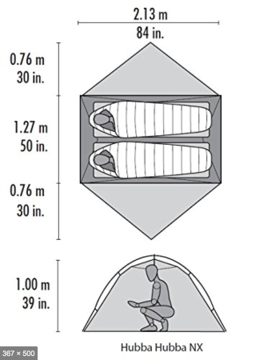
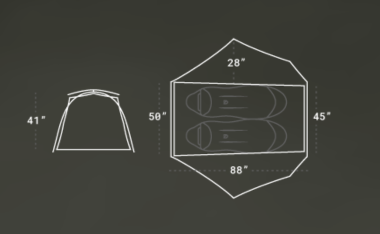
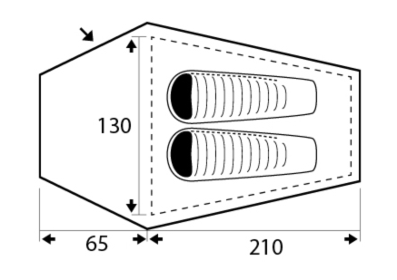
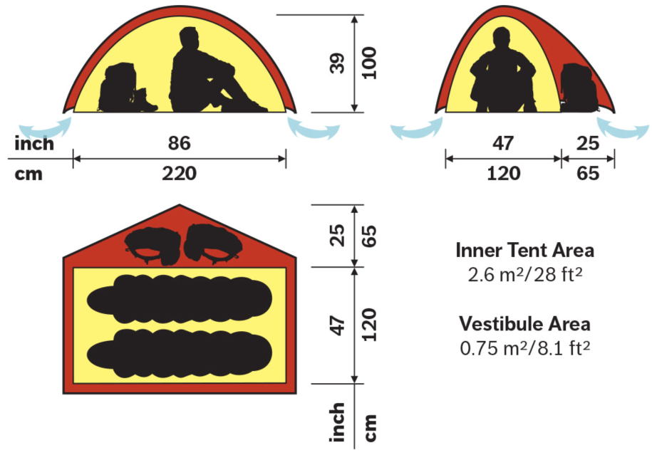
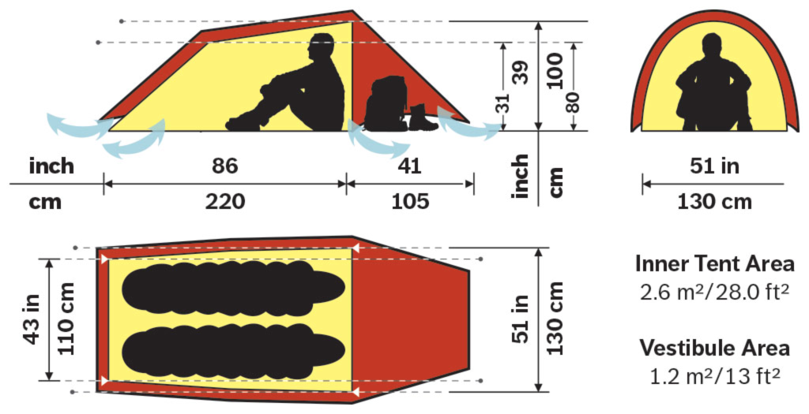
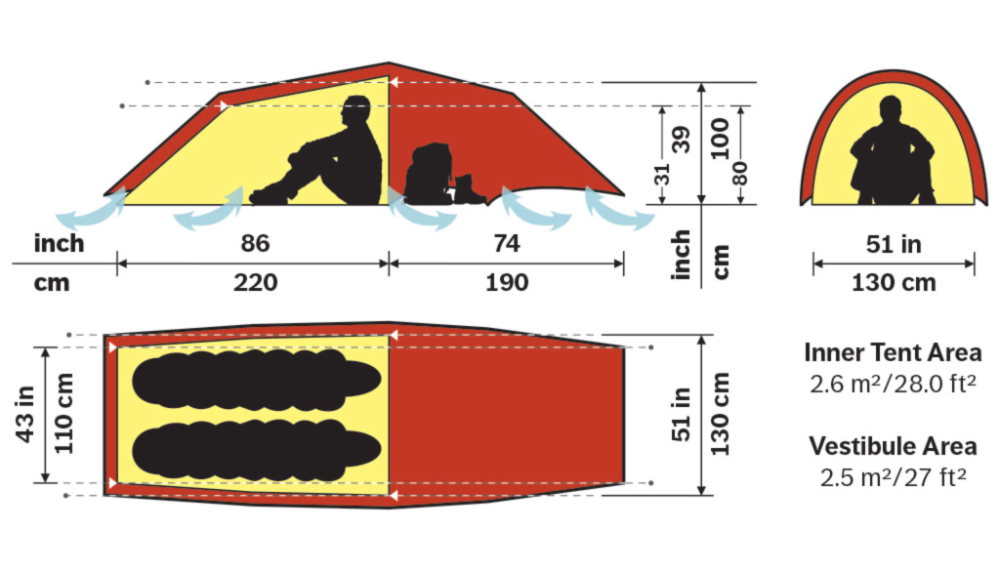
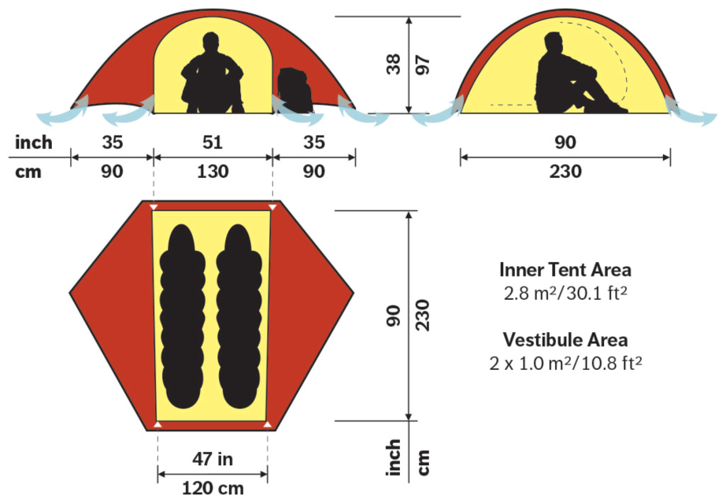

# Tents

## Overview table

| Name | Weight, g | Floor, m² | Vestibule, m² | Materials \(floor/outer/inner\), D | Price, £ |
| :--- | :--- | :--- | :--- | :--- | :--- |
| MSR Hubba Hubba NX | 1720 | 2.7 | 1.62 = 0.81 x 2 | 30/20/20+15\(mesh\) | 385 |
| Nemo Dragonfly 2P | 1410 | 2.7 | 1.8 = 0.9 x 2 | 20/15/10 | 420 |
| Trimm HimLite DSL | 1600 | 2.5 | 0.65 | 10k H₂O / 4k H₂O | 370 € |
| Hilleberg Niak | 1700 | 2.6 | 0.75 | 50\(12k H₂O\)/20/10 | 790 |
| Hilleberg Anjan 2 | 1800 | 2.6 | 1.2 | 50/20/10 | 715 |
| Hilleberg Anjan 2 GT | 2100 | 2.6 | 2.5 | 50/20/10 | 827 |
| Hilleberg Rogen | 2100 | 2.8 | 2.0 = 1.0 x 2 | 50/20/20 | 835 |

## MSR Hubba Hubba NX

[official link](https://www.msrgear.com/ie/products/tents/hubba-hubba-nx-2-person-backpackingandnbsp%3Btent/06204.html?srd=true)

### Reviews

* [prophody](https://propohody.com/msr-hubba-hubba-nx-review/)
* [propohody \#2](https://propohody.com/msr-hubba-hubba-nx-2016/)
* [outdoorgearlab](https://www.outdoorgearlab.com/reviews/camping-and-hiking/backpacking-tent/msr-hubba-hubba-nx)

### Buy

[385 GBP](https://www.ultralightoutdoorgear.co.uk/equipment-c3/tents-shelters-c25/two-person-tents-c26/hubba-hubba-nx-tent-p2405)

### Data

* floor area: 2.7 m² \(29 sq ft\)
* vestibule area: 1.62 m² \(17 sq ft\)
* weight: 1720 g
* rain fly: 20D nylon ripstop, PU coating \(1200mm\)
* inner tent: 20D nylon ripstop, 15D nylon mesh
* floor: 30D ripstop nylon, PU coating \(3000mm\), DWR coating

## Nemo Dragonfly 2p

[official link](https://www.nemoequipment.com/product/dragonfly/)

### Reviews

* [propohody](https://propohody.com/nemo-dragonfly-2p-review/)
* [outdoorgearlab](https://www.outdoorgearlab.com/reviews/camping-and-hiking/backpacking-tent/nemo-dragonfly-2)

### Buy

[420 GBP](https://www.ultralightoutdoorgear.co.uk/equipment-c3/tents-shelters-c25/two-person-tents-c26/dragonfly-2p-tent-p11473)

### Data

* floor area: 2.7 m² \(29 sq ft\)
* vestibule area: 1.8 m² \(20 sq ft\) = \(0.9 m² x 2\)
* weight: 1410 g
* rain fly: 15D nylon ripstop
* inner tent: 10D nylon ripstop
* floor: 20D nylon
* poles: 8.7mm

## Trimm HimLite DSL

[official link](https://www.trimm.cz/en/catalog/himlite-dsl-c1247.htm)

### Reviews

* [propohody](https://propohody.com/trimm-himlite-dsl-review/)

### Data:

* floor area: 2.5 m²
* vestibule area: 0.65 m² 
* weight: ~1600 g \(my version\).
* floor: 10,000 mm H₂O
* rain fly: 4000 mm H₂O, nylon PU
* poles: 8.5mm
* height: 95 cm

## Hilleberg Niak

[official link](https://hilleberg.com/eng/tent/yellow-label-tents/niak/)

### Notes

Niak and other Hilleberg tents are apparently better equipped for bad weather: strong wind and long rain and since we are usually traveling to more challenging destinations \(like Iceland, Scotland, Patagonia, Lake District, etc.\), it might have more sense to invest in something more robust.

In particular, Hilleberg tents are set up "outer tent first", i.e.inner tent is connected to outer tent and you start pitching by just putting poles into sleeves of an outer tent, which make much more sense in rainy weather. Other tents in this list \(including our current one\) are "inner tent goes first", hence one either has to pitch the tent super quickly in the rain to minimise amount of rain getting into the tent or just wait until the rain stops or becomes less intense. The same goes about packing the tent.

Details about the fabric used in Hilleberg tents: [https://hilleberg.com/eng/about-our-tents/materials-uncompromising-quality/\#kerlon1000r](https://hilleberg.com/eng/about-our-tents/materials-uncompromising-quality/#kerlon1000r)

### Reviews

[switchbacktravel](https://www.switchbacktravel.com/reviews/hilleberg-niak)

### Buy

It comes with a free footprint \(but you have to order it separately, it will be discounted from the price\).

* [790 GBP](https://www.ultralightoutdoorgear.co.uk/equipment-c3/tents-shelters-c25/all-tents-c148/niak-2-person-tent-p10986)
* [790 GBP - Taunton](https://www.tauntonleisure.com/hilleberg-niak-tent-green.html) - has free DPD delivery \(next working day\). Have to call to ask for different colors.

### Data:

* floor area: 2.6 m²
* vestibule area: 0.75 m²
* weight: 1700 g
* outer tent: 20D ripstop nylon, 5000 H₂O, [Kerlon 1000](https://hilleberg.com/eng/about-our-tents/materials-uncompromising-quality/#kerlon1000r)
* inner tent: 10D ripstop nylon, DWR
* floor: 50D, 12 000 mm H₂O
* poles: 9mm

## Hilleberg Anjan 2

[official link](https://hilleberg.com/eng/tent/yellow-label-tents/anjan-2/)

### Buy

[715 GBP](https://www.ultralightoutdoorgear.co.uk/equipment-c3/tents-shelters-c25/all-tents-c148/anjan-2-tent-p10499)

### Data

* floor area: 2.6 m² \(28 sq ft\)
* vestibule area: 1.2 m²
* weight: 1800 g
* outer tent: 20D ripstop nylon, 5000 H₂O, [Kerlon 1000](https://hilleberg.com/eng/about-our-tents/materials-uncompromising-quality/#kerlon1000r)
* inner tent: 10D ripstop nylon, DWR
* floor: 50D, PU, 12 000 mm H₂O

## Hilleberg Anjan 2 GT

[official link](https://hilleberg.com/eng/tent/yellow-label-tents/anjan-2-gt/)

### Buy

[827 GBP](https://www.alpinetrek.co.uk/hilleberg-anjan-2-gt-2-man-tent/)

### Reviews

[outdoorgearlab](https://www.outdoorgearlab.com/reviews/camping-and-hiking/backpacking-tent/hilleberg-anjan-2-gt)

### Data

* floor area: 2.6 m² \(28 sq ft\)
* vestibule area: 2.5 m²
* weight: 2100 g
* outer tent: 20D ripstop nylon, 5000 H₂O, [Kerlon 1000](https://hilleberg.com/eng/about-our-tents/materials-uncompromising-quality/#kerlon1000r)
* inner tent: 10D ripstop nylon, DWR
* floor: 50D, PU, 12 000 mm H₂O

## Hilleberg Rogen

[official link](https://hilleberg.com/eng/tent/yellow-label-tents/rogen/)

### Buy

[835 GBP](https://www.ultralightoutdoorgear.co.uk/equipment-c3/tents-shelters-c25/all-tents-c148/rogen-2-person-tent-p10987)

### Data

* floor area: 2.8 m² \(28 sq ft\)
* vestibule area: 2.0 m² = 1.0 x 2
* weight: 2100 g
* outer tent: 20D ripstop nylon, 5000 H₂O, [Kerlon 1000](https://hilleberg.com/eng/about-our-tents/materials-uncompromising-quality/#kerlon1000r)
* inner tent: 20D ripstop nylon, DWR
* floor: 50D, PU, 12 000 mm H₂O

## Other reviews and comparisons

* [generate a new one on outdoorgearlab](https://www.outdoorgearlab.com/topics/camping-and-hiking/best-backpacking-tent/ratings?checkedid_array%5B%5D=54670)
* [switchbacktravel](https://www.switchbacktravel.com/reviews/hilleberg-niak#table)
* [switchbacktravel backpacking tents](https://www.switchbacktravel.com/best-tents-backpacking)

