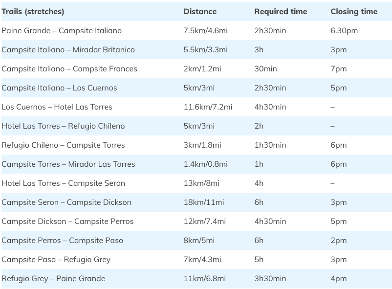
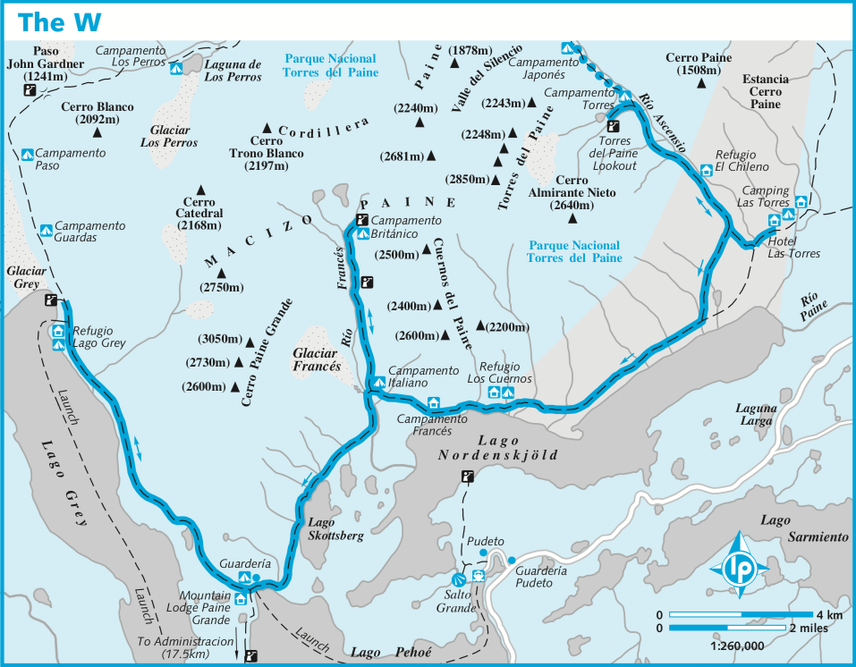

# Torres del Paine

There are two popular routes: "W" \(shorter\) and "O" \(longer\). Camping is allowed only in official spots. All accommodation has to be booked in advance, it is strictly enforced, otherwise you won't be allowed to enter the park.

There are three companies providing camping sites and accommodation: CONAF \(governmental\), Fantastico Sur and Vertice.

Lifehack: book "Chileno" camp site first, since it tends to be very busy, adjust the rest of the tour to that.

## Links

* [StingyNomads](https://stingynomads.com/torres-del-paine-hiking-guide/) - great reference site
* [BestHike.com](https://besthike.com/s-america/patagonian-andes/paine-circuit/) - another reference site

## Maps



## Campsites

### CONAF \(free, governmental, very quick to fill out\)

[Link for reservations](https://wubook.net/wbkd/wbk/?lcode=1470832720) -- currently \(early Jan 2020\) January and February 2020 are fully booked, the first available day is 7th of March.

* Italiano \(on "W"\)
* Paso \(on "O"\)
* Torres \(on "W"\) - closed?

### Vertice Patagonia

[Link for reservations](https://reservas.verticepatagonia.cl/index.xhtml)

* Dickson
* Grey
* Los perros
* Paine Grande

### Fantastico Sur

[Link for reservations](http://www.fantasticosur.com/) -- it looks like the web site is down on weekends!

* Chileno
* Frances
* Los Cuernos
* Seron
* Las Torres \("Campsite Central" on the image below\)

## Routes, times and distances

### Distances

### "O" Route

* Day 1. Las Torres - Seron. 16.5 km. 4 hr.
* Day 2. Seron - Dickson. 18 km. 6 hr
* Day 3. Dickson - Los Perros. 12 km. 4:30 hr
* Day 4. Los Perros - Paso. 8 km. 6 hr. 680 m ascent. 800 m descent. **Paso is already fully booked for Jan/Feb 2020**
* Day 5. Paso - Grey. 10 km, 4 hr.
* Day 6. Grey - Paine Grande. 11 km. 3-4 hr. 300m ascent. 300m descent.
* Day 7. Paine Grande - Los Cuernos. 13 km. 4 hr.
* Day 8. Los Cuernos - Las Torres. 11km. 3 hr. 160m ascent. 100m descent.

### "W" route \(east to west\)

* Day 1. Las Torres - Torres Lookout - Las Torres \(4 hours x 2\)
* Day 2. Las Torres - Los Cuernos. 11.6 km. 4:30. \(or camp Francese\). 100m ascent. 160m descent.
* Day 3. Valle des Frances. Camp at Britanico or Italiano. 520 m ascent/descent.
* Day 4. Britanico/Italian to Paine Grande.
* Day 5. Paine Grande - Grey. \(and back?\)
* Day 6. Grey - Administracia.

### "W" route \(DK version\)

* Night 1. Lake Pehoe.
* Night 2. Paine Grande.
* Night 3. Grey.
* Night 4. Paine Grande.
* Night 5. Frances.
* Night 6. Chileno.

