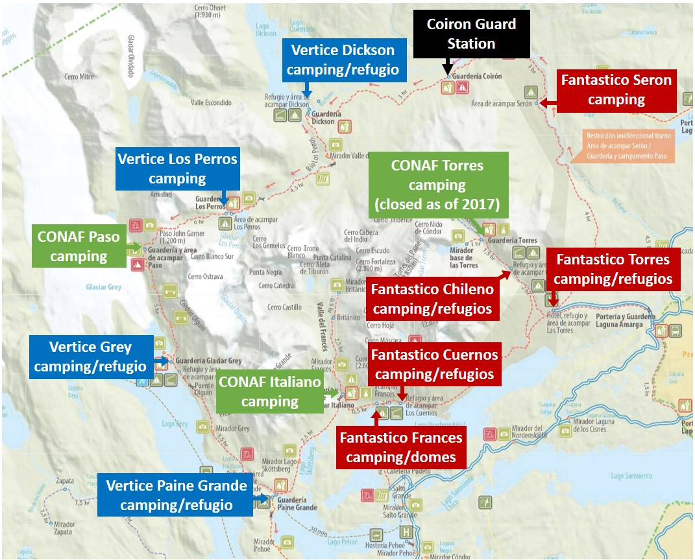
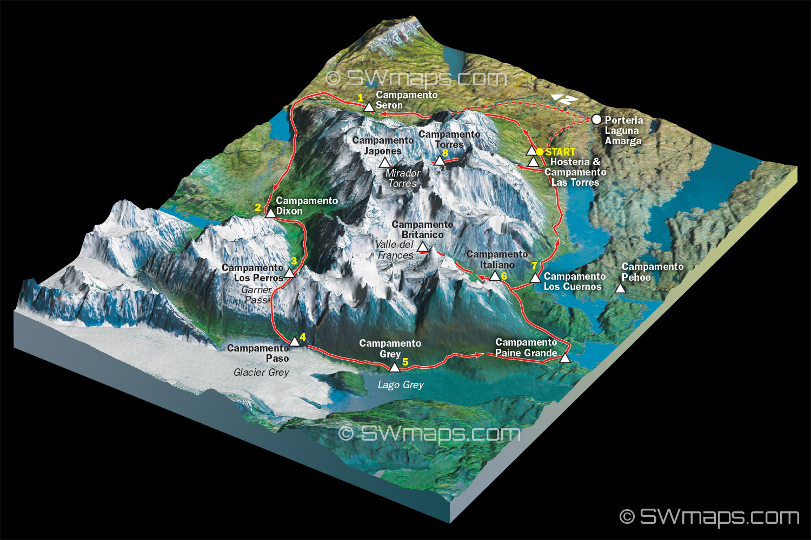
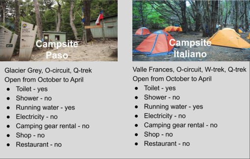
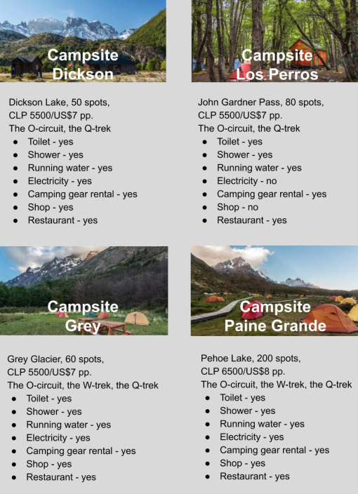
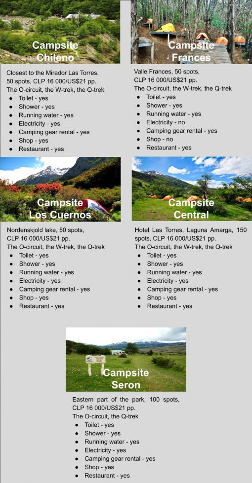

# Torres del Paine

There are two popular routes: "W" \(shorter\) and "O" \(longer\). Camping is allowed only in official spots. All accommodation has to be booked in advance, it is strictly enforced, otherwise you won't be allowed to enter the park.

There are three companies providing camping sites and accommodation: CONAF \(governmental\), Fantastico Sur and Vertice.

Lifehack: book "Chileno" camp site first, since it tends to be very busy, adjust the rest of the tour to that.

## Links

* [StingyNomads](https://stingynomads.com/torres-del-paine-hiking-guide/) - great reference site
* [BestHike.com](https://besthike.com/s-america/patagonian-andes/paine-circuit/) - another reference site

## Maps



## Campsites

### CONAF \(free, governmental, very quick to fill out\)

[Link for reservations](https://wubook.net/wbkd/wbk/?lcode=1470832720) -- currently \(early Jan 2020\) January and February 2020 are fully booked, the first available day is 7th of March.

* Italiano \(on "W"\)
* Paso \(on "O"\)
* Torres \(on "W"\) - closed?

### Vertice Patagonia

[Link for reservations](https://reservas.verticepatagonia.cl/index.xhtml)

* Dickson
* Grey
* Los perros
* Paine Grande

### Fantastico Sur

[Link for reservations](http://www.fantasticosur.com/) -- currently their website is down!

* Chileno
* Frances
* Los Cuernos
* Seron
* Las Torres \("Campsite Central" on the image below\)

